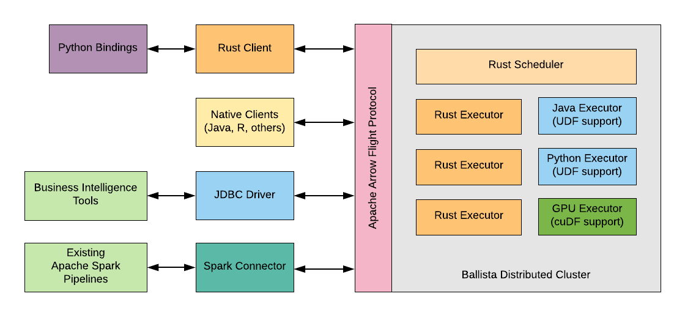

## Overview

Ballista is a distributed compute platform primarily implemented in Rust, and powered by Apache Arrow. It is 
built on an architecture that allows other programming languages to be supported as first-class citizens without paying
a penalty for serialization costs.

The foundational technologies in Ballista are:

- [Apache Arrow](https://arrow.apache.org/) memory model and compute kernels for efficient processing of data.
- [Apache Arrow Flight Protocol](https://arrow.apache.org/blog/2019/10/13/introducing-arrow-flight/) for efficient data transfer between processes.
- [Google Protocol Buffers](https://developers.google.com/protocol-buffers) for serializing query plans.
- [Docker](https://www.docker.com/) for packaging up executors along with user-defined code.

Ballista 0.4.0 will support the following cluster deployment modes:

- Local Mode: Single process containing scheduler and executor, intended for local development testing
- Standalone: Single scheduler process, supporting multiple executor processes that register with the scheduler
- Etcd: Scheduler uses [etcd](https://etcd.io/) as a backing support, so that multiple scheduler instances can run 
  concurrently
- Kubernetes: Schedulers and executors will be deployed as stateful sets in [Kubernetes](https://kubernetes.io/)

## Architecture

The following diagram highlights some of the integrations that will be possible with this unique architecture. Note 
that not all components shown here are available yet.

## How does this compare to Apache Spark?

Although Ballista is largely inspired by Apache Spark, there are some key differences.

- The choice of Rust as the main execution language means that memory usage is deterministic and avoids the overhead of 
GC pauses.
- Ballista is designed from the ground up to use columnar data, enabling a number of efficiencies such as vectorized 
processing (SIMD and GPU) and efficient compression. Although Spark does have some columnar support, it is still 
largely row-based today.
- The combination of Rust and Arrow provides excellent memory efficiency and memory usage can be 5x - 10x lower than 
Apache Spark in some cases, which means that more processing can fit on a single node, reducing the overhead of 
distributed compute.
- The use of Apache Arrow as the memory model and network protocol means that data can be exchanged between executors 
in any programming language with minimal serialization overhead.
  
## Status

Ballista is at the proof-of-concept phase currently but is under active development by a growing community.